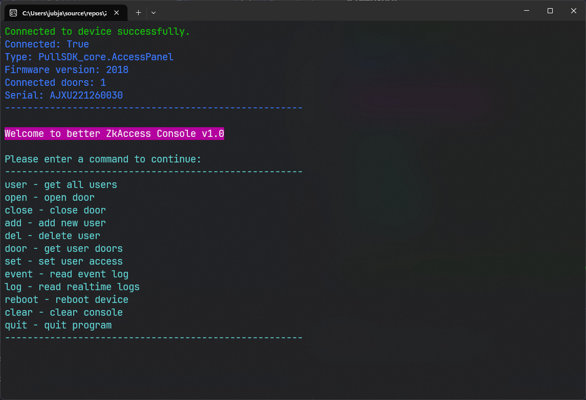

# ZKAccessConsole

## A better way to manage your users on ZKAccess.

This access console is implemented using SDK wrapper from https://github.com/MuaazH / Thank to MuaazH, ZKTeco SDK is really suck.

---

### Features:
- [x] List all users
- [x] Add new user
- [ ] Edit user
- [x] Delete user
- [x] Set user access
- [x] Open/Close door
- [ ] Export/Import users
- [ ] Search users
- [ ] Backup/Restore database
- [ ] Change device password
- [ ] View connected doors
- [ ] Edit doors
- [x] Set device timezone (hardcode)
- [ ] View device status
- [ ] View device settings
- [x] View device events
- [ ] View device timezones
- [x] Reboot device
- [ ] Connection settings (RS485, TCP/IP)

---

### Requirements
- Windows 10 or later
- .NET 8.0 or later (Already included in Windows 11)

---

### Getting startted

1. Download it from release tab
2. Run it

---

### Screenshot

 

### Support this project

Yes please, just a coffee is fine.

Yeah, If you found this project useful, you can buy me a coffee/food or contribute to this project. As it will help me to work more on project like this and so on. Thank you!
