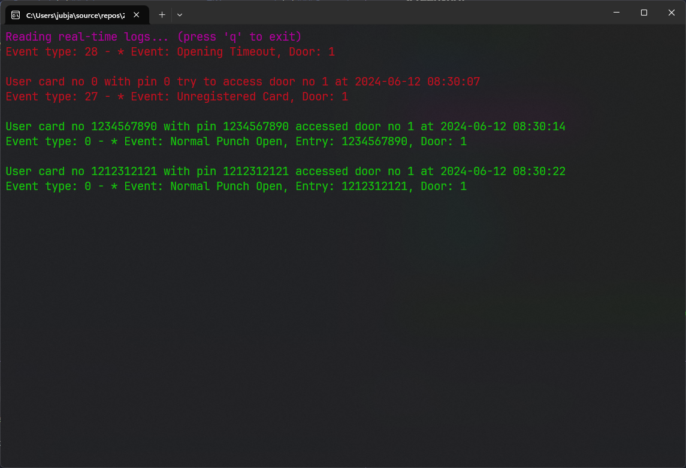

# ZKAccessConsole

## A better way to manage your ZKAccess users.

### Features:
- [x] List all users
- [x] Add new user
- [ ] Edit user
- [x] Delete user
- [x] Set user access
- [x] Open/Close door
- [ ] Export/Import users
- [ ] Search users
- [ ] Backup/Restore database
- [ ] Change device password
- [ ] View device status
- [ ] View device settings
- [x] View device events
- [ ] View device timezones
- [x] Reboot device
- [ ] Connection settings (RS485, TCP/IP)

### Requirements
- Windows 10 or later
- .NET 8.0 or later

### Screenshot

 

